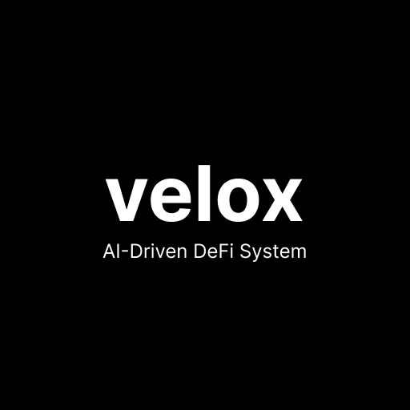
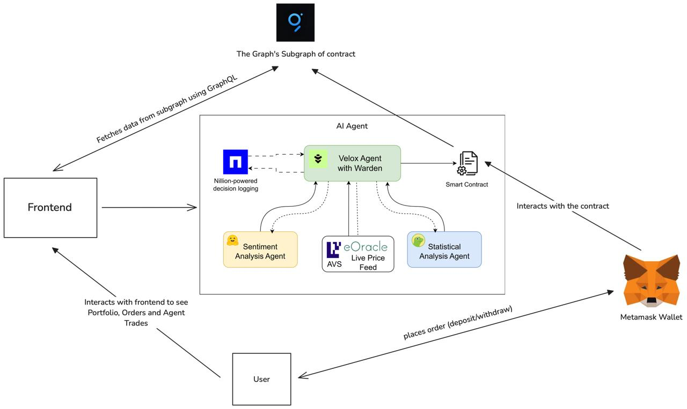

<div align="center">
  
</div>

## Velox: AI-Driven DeFi System

DeFi yield optimization is complex, requiring constant monitoring and manual intervention. 
Velox is an AI-powered multi-agent DeFi system designed to optimize yield through dynamic token swaps, sentiment analysis, and intelligent fund redistribution across liquidity providers. 
By integrating-
- **The Graph** – To enhance user experience and optimize on-chain data access, we leverage The Graph Protocol instead of conventional data-fetching methods. This approach **minimizes latency, boosts efficiency, and enables seamless data retrieval**, ensuring a faster and more responsive user experience.

- **Nillion Protocol** – We implement the **Nillion Secret Vault to securely store LLM decisions and reasoning**, safeguarding against cyber threats and unauthorized analysis. By leveraging its **advanced encryption and privacy-preserving technology**, we prevent potential exploitation of our AI's decision-making processes while maintaining a seamless and secure operational environment.

- **EigenLayer AVS - eOracle** – To ensure real-time pricing data for Ethereum (ETH) and other tokens, we integrate the **EigenLayer AVS eOracle**. This solution provides **accurate and up-to-date pricing information**, enabling Velox to make informed trading decisions and optimize yield through AI-driven strategies.

## Architecture


## Features
To automate the process of maximizing yields in liquidity pools analysis and make informed token buy/sell decisions, we introduce a multi-agent system. This system combines several autonomous agents, external data sources, and advanced models to assess market sentiment, perform technical analysis, and execute trades. Below are the key features we've integrated to ensure a comprehensive and efficient trading experience.

### Sentiment Analysis

- Utilizes a Sentiment Agent to analyze market sentiment for each token.
- Processes news articles and headlines using a News API.
- Employs a Hugging Face BERT-based model for sentiment classification.
- Calculates mean sentiment scores to gauge overall market perception.

### Statistical Analysis

- A Statistical Agent analyzes historical data and real-time statistics.
- Collects data on token prices, liquidity pools, and transaction volumes.
- Generates insights on market conditions, volatility, and risks.
- Provides processed data and insights to the LLM for decision-making.

### Liquidity Pool Analysis

- Dedicated Liquidity Pool Analysis Agent evaluates liquidity pools.
- Checks depths, slippage, and volume changes in real-time.
- Helps the system understand liquidity dynamics for informed decisions.

### LLM Decision-Making

- Core LLM processes inputs from various agents to generate trading strategies.
- Produces buy/sell recommendations and liquidity pool assessments.
- Generates detailed explanations for its decisions, ensuring transparency.

### Trade Execution

- Buy/Sell Execution Agent carries out the LLM's trading decisions.
- Interacts with decentralized exchanges (DEXs) or liquidity pools.
- Monitors and executes trades according to LLM recommendations.

### Security Features

- Nillion, a decentralized storage solution, stores all LLM decisions and reasoning.
- Creates an immutable and transparent record of the system's actions.
- Enables easy tracking and auditing of decisions over time.

### Real-time Pricing

- We eOracle, an EigenLayer AVS, that provides live pricing data for Ethereum (ETH) and other tokens.
- Ensures the most accurate and up-to-date pricing information for trading decisions.

## How it's Made
Velox combines cutting-edge AI techniques, blockchain integrations, and external APIs. The frontend is built using React, while the multi-agent system is implemented in TypeScript.

### LLM Integration

- Serves as the core decision-making engine.
- Processes inputs from various agents to generate comprehensive trading strategies.
- Produces detailed explanations for its decisions, stored in Nillion for transparency.

### Sentiment Analysis Integration

- Utilizes News API for data collection on relevant tokens.
- Implements a Hugging Face BERT-based model for sentiment classification.
- Calculates aggregated sentiment scores for LLM input.

### Statistical and Liquidity Pool Analysis

- Fetches real-time data from exchanges and liquidity pools.
- Processes collected data to identify patterns and generate technical insights.
- Provides processed data and insights to the LLM for informed decision-making.

### Trade Execution Integration

- Implements a dedicated agent for interacting with DEXs and liquidity pools.
- Executes trades based on LLM recommendations and monitors their execution.

### Fast Retrieval of Contract Data with The Graph
- The subgraph is created of the contract.
- GraphQL queries are used to retrieve data from the subgraph on Frontend.

### Contracts

The system includes the following contracts:

1.  `IUniswapV2Router01.sol`
2.  `IUniswapV2Router02.sol`
3.  `InvestmentPool.sol`

These contracts have been integrated to facilitate interactions with Uniswap and manage investment pools, enhancing the system's capabilities in decentralized finance operations.

## Usage
Clone the repository and set up Velox:

```sh
# Clone the repository
git clone https://github.com/sivasathyaseeelan/velox.git

# Navigate to AI system directory
cd velox/velox-ai

# Install dependencies
yarn

# Create a .env file and add the following environment variables:
```

```
PRIVATE_KEY=
RPC_URL=
GROQ_API_KEY=
NEWS_API_KEY=
CONTRACT_ADDRESS=
HUGGINGFACE_API_KEY=
CONTRACT-KEY=
```

```sh
# Navigate to the frontend directory
cd ..

# Install frontend dependencies
yarn

# Start the frontend
yarn dev

# Build the frontend
yarn build
```

#### The Graph

Deployed subgraph link: https://api.studio.thegraph.com/query/103123/velox-graph/version/latest

Refer this to create your own subgraph: https://thegraph.com/docs/en/

### Nillion

Refer schema: [/velox-ai/src/schema.json](./velox-ai/src/schema.json)

### EigenLayer AVS - eOracle

Refer https://docs.eoracle.io/docs/eoracle-price-feeds/feed-addresses


Velox is now set up and ready to optimize yield through AI-powered DeFi trades!
