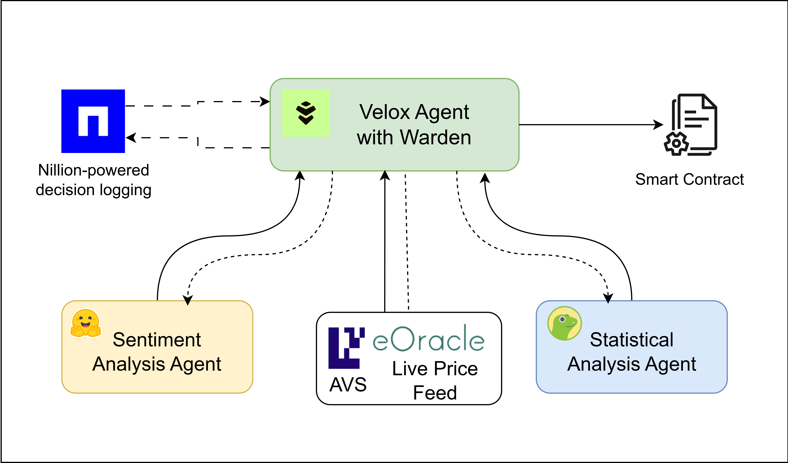

## Features

To automate the process of maximizing yields in liquidity pools analysis and make informed token buy/sell decisions, we introduce a multi-agent system. This system combines several autonomous agents, external data sources, and advanced models to assess market sentiment, perform technical analysis, and execute trades. Below are the key features we've integrated to ensure a comprehensive and efficient trading experience.

### Sentiment Analysis

- Utilizes a Sentiment Agent to analyze market sentiment for each token.
- Processes news articles and headlines using a News API.
- Employs a Hugging Face BERT-based model for sentiment classification.
- Calculates mean sentiment scores to gauge overall market perception.

### Statistical Analysis

- A Statistical Agent analyzes historical data and real-time statistics.
- Collects data on token prices, liquidity pools, and transaction volumes.
- Generates insights on market conditions, volatility, and risks.
- Provides processed data and insights to the LLM for decision-making.

### Liquidity Pool Analysis

- Dedicated Liquidity Pool Analysis Agent evaluates liquidity pools.
- Checks depths, slippage, and volume changes in real-time.
- Helps the system understand liquidity dynamics for informed decisions.

### LLM Decision-Making

- Core LLM processes inputs from various agents to generate trading strategies.
- Produces buy/sell recommendations and liquidity pool assessments.
- Generates detailed explanations for its decisions, ensuring transparency.

### Trade Execution

- Buy/Sell Execution Agent carries out the LLM's trading decisions.
- Interacts with decentralized exchanges (DEXs) or liquidity pools.
- Monitors and executes trades according to LLM recommendations.

### Security Features

- Nillion, a decentralized storage solution, stores all LLM decisions and reasoning.
- Creates an immutable and transparent record of the system's actions.
- Enables easy tracking and auditing of decisions over time.

### Real-time Pricing

- We eOracle, an EigenLayer AVS, that provides live pricing data for Ethereum (ETH) and other tokens.
- Ensures the most accurate and up-to-date pricing information for trading decisions.

## How it's Made

This multi-agent system is developed using a combination of advanced AI techniques, external APIs, and blockchain technologies.

### LLM Integration

- Serves as the core decision-making engine.
- Processes inputs from various agents to generate comprehensive trading strategies.
- Produces detailed explanations for its decisions, stored in Nillion for transparency.

### Sentiment Analysis Integration

- Utilizes News API for data collection on relevant tokens.
- Implements a Hugging Face BERT-based model for sentiment classification.
- Calculates aggregated sentiment scores for LLM input.

### Statistical and Liquidity Pool Analysis

- Fetches real-time data from exchanges and liquidity pools.
- Processes collected data to identify patterns and generate technical insights.
- Provides processed data and insights to the LLM for informed decision-making.

### Trade Execution Integration

- Implements a dedicated agent for interacting with DEXs and liquidity pools.
- Executes trades based on LLM recommendations and monitors their execution.

### Contracts

The system includes the following contracts:

1.  `IUniswapV2Router01.sol`
2.  `IUniswapV2Router02.sol`
3.  `InvestmentPool.sol`

These contracts have been integrated to facilitate interactions with Uniswap and manage investment pools, enhancing the system's capabilities in decentralized finance operations.